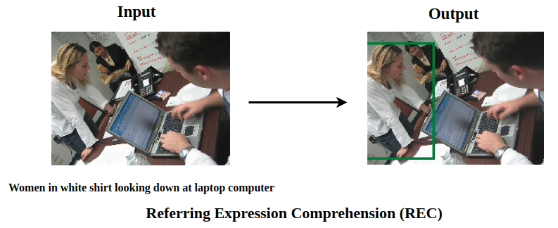

# Awesome-referring-expression-comprehension-code

This repo reproduces a wide rage of papers about Referring Expression Comprehension (REC). The task of REC aims to localize a target object in an image described by a referring expression, as we can see above. In this repo, we advocate **high-quality** implementation. Unlike most open source repos which only implement methods roughly, we carefully check our code and read the original paper to make sure the consistent between them. We also compare the performance of our implementation with the results reported in the original paper to further validate the correctness of our implementation. Only the implementation with closely performance of the original paper will be included in this repo. Furthermore, We rewrite some code, which is originally written with `caffe` or `Tensorflow 1.x` that may annoy someone not familiar with it, with `Tensorflow 2.x` and `PyTorch` which are more readable.

     

## Finished

## Ongoing
 **Model** | **Paper** | **Paper** | **Code** 
|:-:|:-:|:-:|:-:|
| 
[Rohrhach, 2016'ECCV]
 | Grounding of Textual Phrases in Images by Reconstruction | [1511.03745](https://arxiv.org/abs/1511.03745)| - |

## TODO

 **Model** | **Paper** | **Paper** | **Code** 
|:-:|:-:|:-:|:-:|
| 
[Mao, 2016'CVPR]
 |
Generation and Comprehension of Unambiguous Object Descriptions
| [1511.02283](https://arxiv.org/abs/1511.02283)|  |
| [Hu, 2016'CVPR] | Natural Language Object Retrieval | [1511.04164](https://arxiv.org/abs/1511.04164)| - |
| 
[Nagaraja, 2016'ECCV]
 | Modeling Context Between Objects for Referring &nbsp;&nbsp;&nbsp;&nbsp;&nbsp; Expression Understanding | [1608.00525](https://arxiv.org/abs/1608.00525)| - |